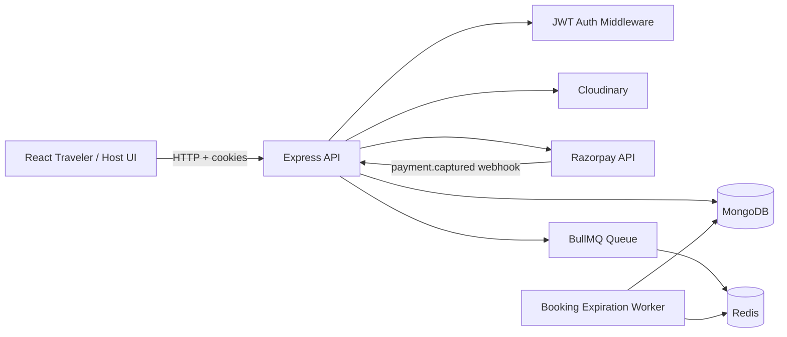
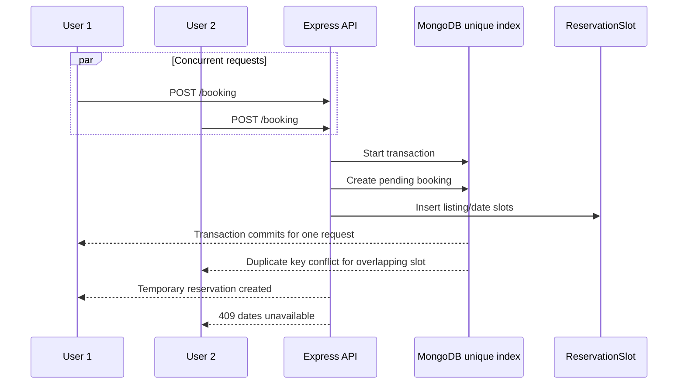

# StayVia

StayVia is a full-stack accommodation marketplace where travelers can discover properties, reserve date ranges, complete online payments, and manage their bookings. Hosts can create listings and view paid reservations for their properties.

This project is more than a basic CRUD application. Its booking subsystem is designed around real-world consistency problems: concurrent reservations, temporary holds, payment expiry, background processing, idempotent payment confirmation, and recovery when a browser callback is lost.

## Project Highlights

- Traveler and host experiences in one React application
- JWT authentication with HTTP-only cookies
- Host-owned listing management with Cloudinary image uploads
- Date-based booking with temporary 15-minute reservations
- MongoDB unique compound index to prevent double booking
- MongoDB transactions for booking and reservation-slot consistency
- BullMQ and Redis expiration jobs
- Separate worker process for releasing unpaid reservations
- Razorpay order creation, signature verification, capture validation, and webhook fallback
- Automatic refund attempt when payment succeeds after a reservation can no longer be confirmed
- Host booking view that exposes only paid confirmed/completed reservations
- Responsive React/Vite frontend with protected routes

## Architecture



### Repository Structure

```text
stayVia/
├── FrontEnd/              React + Vite client
│   └── src/
│       ├── components/    Traveler, host, auth, layout, listing UI
│       ├── pages/         Application screens
│       ├── services/      API service modules
│       ├── hooks/         Data-fetching hooks
│       └── routes/        Protected and public routes
├── Server/                Express API and background worker
│   ├── controller/        Request/business logic
│   ├── models/            Mongoose models
│   ├── routes/            API route definitions
│   ├── queues/            BullMQ queue producers
│   ├── workers/           Background consumers
│   ├── middleware/        JWT protection and shared middleware
│   └── utils/             Payment, geocoding, tokens, and errors
└── README.md
```

## Booking System Design

### Why reservation slots exist

A booking covers a date range, but concurrency must be controlled per individual day. For a booking from June 10 to June 13, the system creates slots for June 10, June 11, and June 12.

The `ReservationSlot` collection has a unique compound index:

```js
reservationSlotSchema.index(
  { listing: 1, date: 1 },
  { unique: true }
);
```

This makes MongoDB the final authority when many users attempt to reserve the same listing and dates at the same time. Only one transaction can insert a particular listing/date pair. Other concurrent attempts receive a duplicate-key conflict and are rejected.

### Concurrent booking flow



### Temporary reservation lifecycle

A successful booking creation does **not** mean payment is complete:

```text
pending + unpaid
      │
      ├── captured payment before expiry ──> confirmed + paid
      │
      └── expiry reached ──> expired + slots deleted
```

The reservation is held for 15 minutes so the user can complete Razorpay checkout. The frontend displays the remaining time, but the server-side `expiresAt` value is authoritative.

### Expiration worker

When a pending booking is created, the API adds an expiration job to BullMQ. The worker:

1. Reads the booking ID from Redis/BullMQ.
2. Updates only bookings that are still `pending`, `unpaid`, and expired.
3. Deletes the booking's reservation slots in the same MongoDB transaction.
4. Leaves confirmed/paid bookings untouched.

The conditional update prevents a race where the worker and payment confirmation execute at nearly the same time.

### Payment safety

The payment flow validates:

- Booking ownership
- Booking state and expiry
- Razorpay order ID
- Razorpay signature
- Payment amount and currency
- Razorpay payment capture status
- Existence of all expected reservation slots

Payment confirmation uses an atomic database update. If Razorpay captures money after the reservation has expired or its slots are missing, the system does not confirm the booking and attempts a refund.

There are two confirmation paths:

```text
Normal:  Razorpay -> browser callback -> POST /booking/:id/payment/verify
Backup:  Razorpay -> signed webhook -> POST /payment/webhook
```

Repeated callbacks are handled idempotently. A booking already confirmed with the same payment ID is returned as successful rather than processed again.

## Implemented User Flows

### Traveler

1. Sign up or log in.
2. Browse published listings.
3. Open a listing detail page.
4. Select check-in, check-out, and guests.
5. Check availability.
6. Create a temporary reservation.
7. Complete payment in Razorpay.
8. See a booking confirmation receipt.
9. View confirmed bookings in My Bookings.
10. Resume an active pending payment before its expiry.

### Host

1. Open the host workspace.
2. View the host dashboard.
3. Create, edit, and delete owned listings.
4. Upload listing images through Cloudinary.
5. View paid confirmed/completed bookings for owned listings.
6. Switch back to traveler mode through the profile menu.

Pending or abandoned payment attempts are intentionally not shown to hosts.

## API Reference

All protected endpoints require the JWT authentication cookie created during login. The frontend sends credentials with requests.

### Health

| Method | Endpoint | Auth | Description |
|---|---|---:|---|
| `GET` | `/` | No | Backend health response |

### Authentication

| Method | Endpoint | Auth | Description |
|---|---|---:|---|
| `POST` | `/auth/signup` | No | Create a user account |
| `POST` | `/auth/login` | No | Authenticate and set JWT cookie |
| `POST` | `/auth/logout` | No | Clear authentication cookie |
| `GET` | `/auth/me` | Yes | Return the current user |

### Listings

| Method | Endpoint | Auth | Description |
|---|---|---:|---|
| `GET` | `/listing` | No | Fetch published listings |
| `GET` | `/listing/:id` | No | Fetch one listing |
| `GET` | `/listing/my` | Yes | Fetch listings owned by the current user |
| `POST` | `/listing` | Yes | Create a listing; supports multipart image upload |
| `PUT` | `/listing/:id` | Yes | Update an owned listing |
| `DELETE` | `/listing/:id` | Yes | Delete an owned listing |

### Booking and payment

| Method | Endpoint | Auth | Description |
|---|---|---:|---|
| `GET` | `/booking/availability/:listingId` | Yes | Check a listing/date range |
| `POST` | `/booking` | Yes | Create or reuse a temporary pending reservation |
| `GET` | `/booking/user-bookings` | Yes | Fetch active pending and paid user bookings |
| `GET` | `/booking/host-bookings` | Yes | Fetch paid bookings for owned listings |
| `GET` | `/booking/:bookingId` | Yes | Fetch a paid booking owned by the current user |
| `POST` | `/booking/:bookingId/payment` | Yes | Create or reuse a Razorpay order |
| `POST` | `/booking/:bookingId/payment/verify` | Yes | Verify and confirm a captured payment |
| `POST` | `/payment/webhook` | No* | Receive signed Razorpay `payment.captured` events |

`/payment/webhook` does not use user authentication because Razorpay calls it directly. It must be protected by `RAZORPAY_WEBHOOK_SECRET` signature validation.

## Local Setup

### Requirements

- Node.js 22+
- MongoDB configured as a replica set, because booking transactions require transactions
- Redis 6+
- Razorpay test account and credentials
- Cloudinary account for listing images
- Geoapify API key for address geocoding

### Environment variables

Create `Server/.env`:

```env
NODE_ENV=development
PORT=8080
MONGO_URI=mongodb://127.0.0.1:27017/stayvia?replicaSet=rs0
JWT_SECRET=replace_with_a_long_random_secret

CLOUDINARY_CLOUD_NAME=your_cloud_name
CLOUDINARY_KEY=your_cloudinary_key
CLOUDINARY_SECRET=your_cloudinary_secret
GEOAPIFY_API_KEY=your_geoapify_key

RAZORPAY_KEY_ID=your_razorpay_key_id
RAZORPAY_KEY_SECRET=your_razorpay_key_secret
RAZORPAY_WEBHOOK_SECRET=your_razorpay_webhook_secret

REDIS_HOST=127.0.0.1
REDIS_PORT=6379
REDIS_PASSWORD=
```

Create `FrontEnd/.env`:

```env
VITE_API_URL=http://localhost:8080
VITE_RAZORPAY_KEY_ID=your_razorpay_key_id
```

### Start the backend API

```bash
cd Server
npm install
npm start
```

### Start the expiration worker

Run this in a second terminal:

```bash
cd Server
npm run worker
```

### Start the frontend

Run this in a third terminal:

```bash
cd FrontEnd
npm install
npm run dev
```

The frontend runs on the Vite development URL, normally `http://localhost:5173`.

### Build and lint the frontend

```bash
cd FrontEnd
npm run lint
npm run build
```

## Data Model Summary

- `User`: traveler/host account and authentication identity
- `Listing`: property details, owner, address, geometry, price, images, and status
- `Booking`: guest, listing, dates, price snapshot, booking state, payment state, expiry, and payment references
- `ReservationSlot`: one listing/date reservation owned by a booking; protected by a unique index
- `Review`: review model and review-related functionality currently being completed

## Current Scope and Remaining Work

The core marketplace and payment-backed booking flow are implemented. The following areas are intentionally next-stage work:

- Backend-driven filtering, search, and pagination
- Full host calendar and availability management
- Booking cancellation policy and refund management UI
- Email notifications and check-in reminders
- Review submission, display, and deletion integration
- Automated API/integration tests for concurrency and payment races
- Payment reconciliation and refund retry monitoring
- Rate limiting and stronger request validation for public endpoints
- Production deployment configuration and observability

## Engineering Decisions Worth Reviewing

### Why MongoDB owns concurrency

Application-level availability checks alone are subject to a check-then-insert race. The unique `{ listing, date }` index gives the database a definitive conflict boundary, while the transaction keeps the booking document and reservation slots consistent.

### Why temporary holds are necessary

Without a temporary hold, multiple users could open checkout for the same dates. A hold ensures only one user can proceed with payment for a date range at a time. The hold is time-bounded and automatically released if unpaid.

### Why there is both a worker and defensive checks

The BullMQ worker handles normal expiry asynchronously. The API also checks `expiresAt` during availability, payment creation, and payment confirmation so the system remains correct if Redis or a worker is temporarily delayed.

### Why the webhook exists

A browser callback is not reliable enough by itself: the user can close the tab or lose network access after Razorpay captures payment. The signed webhook gives the backend a second path to reconcile the payment.

## License

This project is currently a portfolio/application project. Add a formal license before distributing it publicly.
